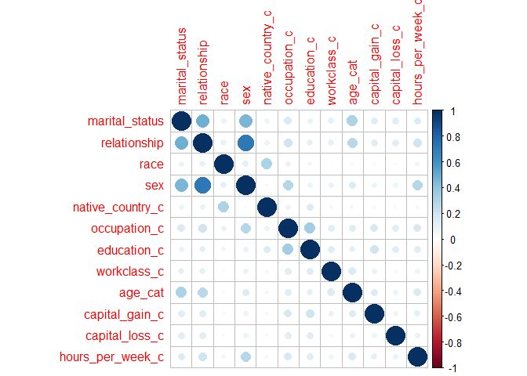
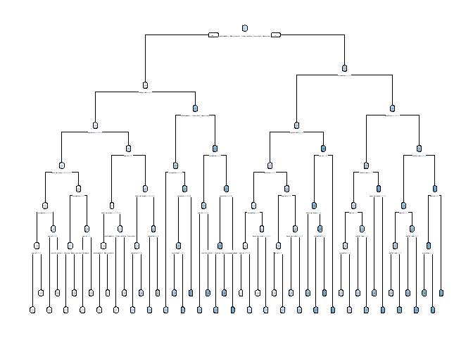
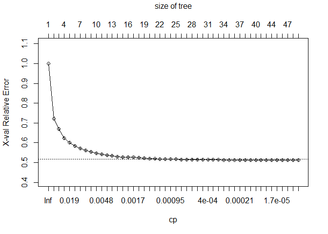
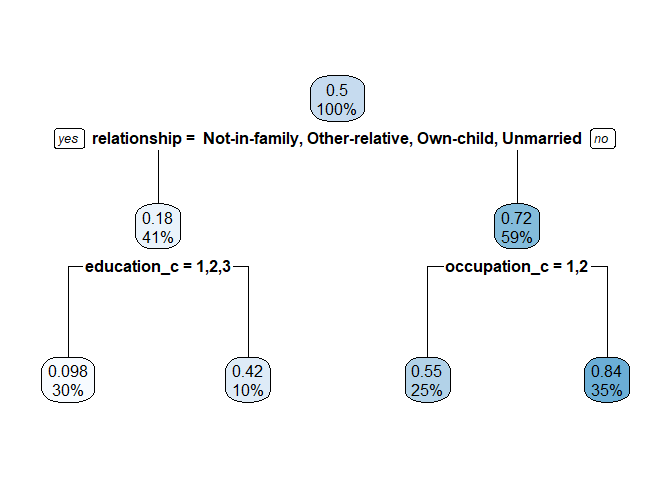
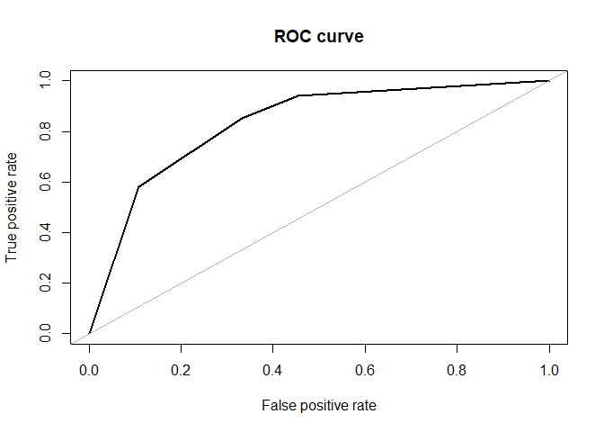
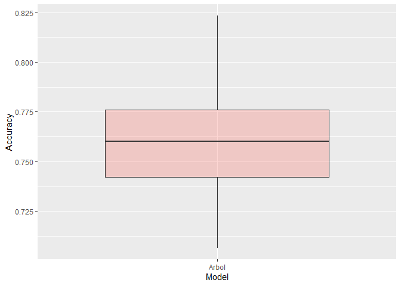
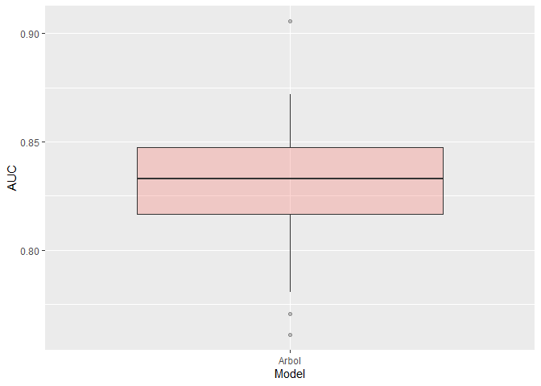

knit: (function(input_file, encoding) {
  out_dir <- 'docs';
  rmarkdown::render(input_file,
 encoding=encoding,
 output_file=file.path(dirname(input_file), out_dir, 'index.html'))})


# Objetivo

Construir árbol de decisión a partir del dataset adult data (https://archive.ics.uci.edu/ml/datasets/Adult) y luego elaborar informe presentando sus hallazgos, el modelo, la interpretación y sus conclusiones.


 * Fecha de publicación: 28-07-21
 * Fecha de entrega: 11-08-21 (23:59 hrs)

# Instrucciones
  1.	Trabajo Grupal: 3 a 4 personas
  2.	Considerar la rúbrica de evaluación para el desarrollo del trabajo
  3.	Para la entrega deben enviar un mail a josealexyanez@live.com y juan.herrera.ordenes@gmail.com con        asunto “Entrega Trabajo Grupo [Nombre Apellido Primer Integrante]/[Nombre Apellido Segundo Integrante]/[Nombre Apellido Tercer Integrante]”
  4.	Adjuntar en el mail el script en formato .R


# Knowledge Discovery in DataBase


Para entender mejor este proceso, vamos a descomponerlo en sus 6 pasos fundamentales. Para cada paso, mostraremos sus componentes o etapas y algunas sugerencias o recomendaciones.

## Compresión del Dominio del Estudio

Compresión del Dominio del Estudio y Establecimiento de Objetivos, implica que se debe buscar


* Desarrollo de un entendimiento sobre el area de estudio o negocio
* Descubrimiento de conocimiento previo que sea relevante y motive el estudio
* Definición del objetivo del KDD (Para Qué, Cómo y Cuándo$?$)


Como en cualquier tipo de investigación, es fundamental tener muy claros los límites y objetivos de lo que pretendemos. Es muy fácil perder el rumbo en el océano infinito de datos a nuestra disposición.

En este paso es cuando reconocemos las fuentes de información más importantes y quienes tienen control sobre ellas. También es relevante incluir toda la metadata relacionada, dimensionar la cantidad de datos, y formatos.

Se recomienda que toda la información más importante que se encuentre solamente en medios físicos y sea digitalizada, previo a iniciar las actividades de KDD.

## Creación de un set de datos (dataset) objetivo

Selección e integración de los datos objetivo provenientes de fuentes múltiples y heterogéneas.


* Que se encuentren en bases de datos relacionales, 
* colecciones de documentos, 
* correos electrónicos, 
* fotografías, clips de vídeo, 
* bases de datos de transacciones de clientes, 
* registros web, o web logs, etc. 


Es importante homogeneizar los formatos para que los datos sean más fáciles de procesar y analizar.


## Limpieza y procesamiento de  Datos

El preprocesamiento y la limpieza tienen el objetivo de mejorar la calidad de los datos y los resultados de la minería. 

\begin{itemize}
\item Eliminación de ruido y datos aislados o outliers.
\item Uso del conocimiento previo para eliminar las inconsistencias y datos duplicados.
\item Uso de estrategias para manejar la información faltante en los datasets.
\end{itemize}

Los datasets disponibles en la actualidad usualmente están incompletos (valores de atributos faltantes), tienen ruido (errores y datos aislados o outliers), o presentan inconsistencias (discrepancias en los datos recolectados). Estos ''datos sucios" pueden confundir el proceso de minería y conducir a resultados inválidos o poco confiables.


## Minería de datos

En general, la minería de datos comprende estos pasos: 
\begin{enumerate}
\item Seleccionar la tarea, Para saber qué algoritmos serán más útiles, primero es necesario saber qué tarea queremos realizar. 
\item Puede ser que estemos buscando resultados estadísticos (como mediana o media por ejemplo), o bien, que nuestro objetivo sea realizar una predicción, una asociación, o identificar secuencias de datos.
\item Seleccionar el (los) algoritmos.
\item Finalmente aplicar algoritmos seleccionados.
\end{enumerate}


Cuando se realiza Minería de Datos en realidad lo que hacemos es convertirnos en exploradores. Nos adentramos en la inmensidad de los datos y descubrimos poco a poco los patrones o modelos presentes en ellos; las relaciones. Y en esta exploración, una de nuestras herramientas más útiles son los algoritmos, básicamente un algoritmo es una serie de instrucciones o reglas establecidas en un programa informático que nos permiten llegar a un resultado o solución.


En el caso de la minería de datos, un algoritmo nos permite procesar un set de datos para obtener nueva información sobre ese mismo dataset.

La minería de datos se ocupa de reunir los datos de manera novedosa, entendible y útil para el propietario o usuario final.

## Interpretación de los patrones minados.}

Al encontrar los patrones y modelos en los datos analizados. Los resultados deben presentarse en un formato entendible. Por esta razón las técnicas de visualización son importantes para que los resultados sean útiles, dado que los modelos matemáticos o descripciones en formato de texto pueden ser difíciles de interpretar para los usuarios finales. 


 
Desde este punto del proceso es posible regresar a cualquiera de los pasos anteriores.
Es importante que comprendamos la diferencia entre dos términos clave:

* **Patrones**: son estructuras locales que hacen declaraciones sólo sobre un espacio restringido por variables. Esto tiene aplicaciones importantes en detección de anomalías como la detección de faltas en procesos industriales o de fraudes en el sistema bancario.
* **Modelos**: son estructuras globales que hacen declaraciones sobre cualquier punto en el espacio de medición. Por ejemplo, los modelos pueden predecir el valor de alguna otra variable.


## Utilización del conocimiento}

Descubrimos el conocimiento oculto en nuestros datos. Ahora es el momento de usar ese conocimiento para tomar mejores decisiones.

# Funcionalidad Código R

## Ambiente R y Carga de librerías


```r
#==============================================================================#
#---------------------------- LIBRERIAS ---------------------------------------#
#==============================================================================#
library(sqldf)
```

```
## Loading required package: gsubfn
```

```
## Loading required package: proto
```

```
## Loading required package: RSQLite
```

```r
library(plyr)
library(dplyr)
```

```
## 
## Attaching package: 'dplyr'
```

```
## The following objects are masked from 'package:plyr':
## 
##     arrange, count, desc, failwith, id, mutate, rename, summarise,
##     summarize
```

```
## The following objects are masked from 'package:stats':
## 
##     filter, lag
```

```
## The following objects are masked from 'package:base':
## 
##     intersect, setdiff, setequal, union
```

```r
library(nFactors)
```

```
## Loading required package: lattice
```

```
## 
## Attaching package: 'nFactors'
```

```
## The following object is masked from 'package:lattice':
## 
##     parallel
```

```r
library(RODBC)
library(reshape2)
library(reshape)
```

```
## 
## Attaching package: 'reshape'
```

```
## The following objects are masked from 'package:reshape2':
## 
##     colsplit, melt, recast
```

```
## The following object is masked from 'package:dplyr':
## 
##     rename
```

```
## The following objects are masked from 'package:plyr':
## 
##     rename, round_any
```

```r
library(foreign)
library(memisc)
```

```
## Loading required package: MASS
```

```
## 
## Attaching package: 'MASS'
```

```
## The following object is masked from 'package:dplyr':
## 
##     select
```

```
## 
## Attaching package: 'memisc'
```

```
## The following object is masked from 'package:reshape':
## 
##     rename
```

```
## The following objects are masked from 'package:dplyr':
## 
##     collect, recode, rename, syms
```

```
## The following object is masked from 'package:plyr':
## 
##     rename
```

```
## The following objects are masked from 'package:stats':
## 
##     contr.sum, contr.treatment, contrasts
```

```
## The following object is masked from 'package:base':
## 
##     as.array
```

```r
library(car)
```

```
## Loading required package: carData
```

```
## 
## Attaching package: 'car'
```

```
## The following object is masked from 'package:memisc':
## 
##     recode
```

```
## The following object is masked from 'package:dplyr':
## 
##     recode
```

```r
library(data.table)
```

```
## 
## Attaching package: 'data.table'
```

```
## The following object is masked from 'package:reshape':
## 
##     melt
```

```
## The following objects are masked from 'package:reshape2':
## 
##     dcast, melt
```

```
## The following objects are masked from 'package:dplyr':
## 
##     between, first, last
```

```r
library(psych)
```

```
## 
## Attaching package: 'psych'
```

```
## The following object is masked from 'package:car':
## 
##     logit
```

```r
library(aod)
library(ggplot2)
```

```
## 
## Attaching package: 'ggplot2'
```

```
## The following objects are masked from 'package:psych':
## 
##     %+%, alpha
```

```
## The following object is masked from 'package:memisc':
## 
##     syms
```

```r
library(caret)
library(clusterSim)
```

```
## Loading required package: cluster
```

```r
library(devtools)
```

```
## Loading required package: usethis
```

```r
library(mice)
```

```
## 
## Attaching package: 'mice'
```

```
## The following object is masked from 'package:stats':
## 
##     filter
```

```
## The following objects are masked from 'package:base':
## 
##     cbind, rbind
```

```r
library(MASS)
library(rpart)
library(rpart.plot)
library(caTools)
library(ROSE)
```

```
## Loaded ROSE 0.0-4
```

```r
library(smbinning) 
```

```
## Loading required package: partykit
```

```
## Loading required package: grid
```

```
## Loading required package: libcoin
```

```
## Loading required package: mvtnorm
```

```
## Loading required package: Formula
```

```r
library(pROC)
```

```
## Type 'citation("pROC")' for a citation.
```

```
## 
## Attaching package: 'pROC'
```

```
## The following objects are masked from 'package:stats':
## 
##     cov, smooth, var
```

```r
library(randomForest)
```

```
## Warning: package 'randomForest' was built under R version 4.1.1
```

```
## randomForest 4.6-14
```

```
## Type rfNews() to see new features/changes/bug fixes.
```

```
## 
## Attaching package: 'randomForest'
```

```
## The following object is masked from 'package:ggplot2':
## 
##     margin
```

```
## The following object is masked from 'package:psych':
## 
##     outlier
```

```
## The following object is masked from 'package:dplyr':
## 
##     combine
```

```r
library(ROCR)
```

```
## Warning: package 'ROCR' was built under R version 4.1.1
```

```r
library(corrplot)
```

```
## corrplot 0.90 loaded
```

```r
library(cvTools)
```

```
## Loading required package: robustbase
```


## Carga de Datos

```r
#==============================================================================#
# Paso 1: Carga de Datos 
#==============================================================================#

#-------------------------------------------------------------------------------#
url <- "https://archive.ics.uci.edu/ml/machine-learning-databases/adult/adult.data"

adult_data <- read.table(url, sep = ",",stringsAsFactors = T)
nombres <- unlist(strsplit("age workclass fnlwgt education education_num marital_status occupation relationship race sex capital_gain capital_loss hours_per_week native_country tramo", split = " "))
colnames(adult_data) <- nombres

#-------------------------------------------------------------------------------#
#Quitamos espacios en campos de variables que vamos a categorizar

adult_data$native_country <- gsub( " ", "", adult_data$native_country )
adult_data$occupation <- gsub( " ", "", adult_data$occupation)
adult_data$education <- gsub( " ", "", adult_data$education)
adult_data$workclass <- gsub( " ", "", adult_data$workclass)
adult_data$tramo <- gsub( " ", "", adult_data$tramo)

#-------------------------------------------------------------------------------#
#Variable dependiente  auxiliar 
adult_data$Clase <- ifelse(adult_data$tramo == ">50K", 1, 0)

table(adult_data$Clase)
```

```
## 
##     0     1 
## 24720  7841
```

```r
table(adult_data$tramo)
```

```
## 
## <=50K  >50K 
## 24720  7841
```

```r
#------------------------------------------------------------------------------#
#Tipos de variables 

count <- function(x)
{
  n <- length(x)
  acum <- c()
  for(i in 1:n)
  {
    res <- table(adult_data[x[i]])
    acum[i] <- length(res)
  }
  return(acum)
}

Type <- data.frame(var = names(adult_data),type = sapply(adult_data, class))

Type$ncat <- count(Type$var)

Type$Comentario <- ifelse(Type$type %in% c("character", "integer")  & Type$ncat > 7, "Categorizar", "NO")

Type
```

```
##                           var      type  ncat  Comentario
## age                       age   integer    73 Categorizar
## workclass           workclass character     9 Categorizar
## fnlwgt                 fnlwgt   integer 21648 Categorizar
## education           education character    16 Categorizar
## education_num   education_num   integer    16 Categorizar
## marital_status marital_status    factor     7          NO
## occupation         occupation character    15 Categorizar
## relationship     relationship    factor     6          NO
## race                     race    factor     5          NO
## sex                       sex    factor     2          NO
## capital_gain     capital_gain   integer   119 Categorizar
## capital_loss     capital_loss   integer    92 Categorizar
## hours_per_week hours_per_week   integer    94 Categorizar
## native_country native_country character    42 Categorizar
## tramo                   tramo character     2          NO
## Clase                   Clase   numeric     2          NO
```
## Categorización de Variables

```r
#==============================================================================#
# Paso 2: Categorización de Variables
#==============================================================================#

adult_data$native_country_c <- ifelse(adult_data$native_country %in% c("Columbia",
                                                                       "Dominican-Republic",
                                                                       "Guatemala",
                                                                       "Holand-Netherlands",
                                                                       "Outlying-US(Guam-USVI-etc)",
                                                                       "Ecuador",
                                                                       "El-Salvador",
                                                                       "Haiti",
                                                                       "Honduras",
                                                                       "Jamaica",
                                                                       "Laos",
                                                                       "Mexico",
                                                                       "Nicaragua",
                                                                       "Peru",
                                                                       "Portugal",
                                                                       "Puerto-Rico",
                                                                       "Trinadad&Tobago",
                                                                       "Vietnam"), 1,
                                      ifelse(adult_data$native_country %in% c("Hungary",
                                                                              "Ireland",
                                                                              "Poland",
                                                                              "Scotland",
                                                                              "South",
                                                                              "Thailand",
                                                                              "United-States"), 2,
                                             ifelse(adult_data$native_country %in% c("?",
                                                                                     "Canada",
                                                                                     "China",
                                                                                     "Cuba",
                                                                                     "England",
                                                                                     "Germany",
                                                                                     "Greece",
                                                                                     "Hong",
                                                                                     "Italy",
                                                                                     "Philippines"), 3,4)))

table(adult_data$native_country_c, useNA = "always")
```

```
## 
##     1     2     3     4  <NA> 
##  1443 29377  1421   320     0
```

```r
#------------------------------------------------------------------------------#

adult_data$occupation_c <- ifelse(adult_data$occupation %in% c("Priv-house-serv",
                                                               "Other-service",
                                                               "Handlers-cleaners",
                                                               "?",
                                                               "Armed-Forces",
                                                               "Farming-fishing",
                                                               "Machine-op-inspct",
                                                               "Adm-clerical"),1,
                           ifelse(adult_data$occupation %in% c("Transport-moving",
                                                                      "Craft-repair"),2,
                           ifelse(adult_data$occupation %in% c("Sales",
                                                                             "Tech-support",
                                                                             "Protective-serv"),3,4)))


table(adult_data$occupation_c, useNA = "always")
```

```
## 
##     1     2     3     4  <NA> 
## 13432  5696  5227  8206     0
```

```r
#------------------------------------------------------------------------------#

adult_data$education_c <- ifelse(adult_data$education %in% c("Preschool",
                                                             "1st-4th",
                                                             "5th-6th",
                                                             "11th",
                                                             "9th",
                                                             "7th-8th",
                                                             "10th",
                                                             "12th"), 1, 
                                 ifelse(adult_data$education %in% c("HS-grad",
                                                                    "Some-college"), 2, 
                                        ifelse(adult_data$education %in% c("Assoc-acdm",
                                                                           "Assoc-voc"), 3, 
                                               ifelse(adult_data$education %in% c("Bachelors",
                                                                                  "Masters"), 4, 5)))) 

table(adult_data$education_c, useNA = "always")
```

```
## 
##     1     2     3     4     5  <NA> 
##  4253 17792  2449  7078   989     0
```

```r
#------------------------------------------------------------------------------#

adult_data$workclass_c <- ifelse(adult_data$workclass %in% c("Never-worked",
                                                             "Without-pay",
                                                             "?", "Private"), 1, 
                          ifelse(adult_data$workclass %in% c("State-gov",
                                                                           "Self-emp-not-inc",
                                                                           "Local-gov"), 2, 3))

table(adult_data$workclass_c, useNA = "always")
```

```
## 
##     1     2     3  <NA> 
## 24553  5932  2076     0
```

## Eliminar Valores Perdidos

```r
#==============================================================================#
# Paso 3: Eliminar valores perdidos
#==============================================================================#

na_count <-sapply(adult_data, function(y) sum(length(which(y == "?"))))
na_count <- data.frame(na_count)

adult_data_dep <- subset(adult_data, workclass != "?" & native_country != "?" & occupation != "?")


na_count <-sapply(adult_data_dep, function(y) sum(length(which(y == "?"))))
na_count <- data.frame(na_count)
```

## Muestra de Entrenamiento y Validación


```r
#==============================================================================#
# Paso 4: Muestra de Entrenamiento y Validación
#==============================================================================#

set.seed(98797)

split <- sample.split(adult_data_dep$Clase, SplitRatio = 0.7)
N <- dim(adult_data_dep)[1]
#------------------------------------------------------------------------------#

prop.table(table(adult_data_dep$Clase, useNA = "always"))
```

```
## 
##         0         1      <NA> 
## 0.7510775 0.2489225 0.0000000
```

```r
#------------------------------------------------------------------------------#
#Muestra de Entrenamiento
train_samp <- subset(adult_data_dep, split == TRUE)
n_train <- dim(train_samp)[1]

Porc_train <- n_train/N
Porc_train
```

```
## [1] 0.7000199
```

```r
prop.table(table(train_samp$Clase, useNA = "always"))
```

```
## 
##         0         1      <NA> 
## 0.7510656 0.2489344 0.0000000
```

```r
#------------------------------------------------------------------------------#
#Muestra de validaci?n
valid_samp <- subset(adult_data_dep, split == FALSE)
n_val <- dim(valid_samp)[1]

Porc_val <- n_val/N
Porc_val
```

```
## [1] 0.2999801
```

```r
prop.table(table(valid_samp$Clase, useNA = "always"))
```

```
## 
##         0         1      <NA> 
## 0.7511052 0.2488948 0.0000000
```

## Balanceo Muestra de Entrenamiento

```r
#==============================================================================#
# Paso 5: balanceo de Muestra de Entrenamiento
#==============================================================================#
#conteo de casos
table(train_samp$Clase)
```

```
## 
##     0     1 
## 15858  5256
```

```r
#over sampling
data_balanced_over <- ovun.sample(Clase ~ ., data = train_samp, method = "over", N = 2 * 15858)$data
table(data_balanced_over$Clase)
```

```
## 
##     0     1 
## 15858 15858
```

```r
#under sampling
data_balanced_under <- ovun.sample(Clase ~ ., data = train_samp, method = "under", N = 2 * 5256, seed = 1)$data
table(data_balanced_under$Clase)
```

```
## 
##    0    1 
## 5256 5256
```

## Estadísticas Descriptivas

```r
#==============================================================================#
# Paso 6: Estadísticas Descriptivas y Ranking de Variables
#==============================================================================#

#Estad?stica Descriptiva
#Herramientas de Analisis:
#  1. Histograma
#  2. Tablas de Contingencia
#  3. Box - plot para variables de interes (test -t u otro analisis)
#  2. Resumen de Estadisticas: min, max, media, rango, etc
```

## Categorizar variables continuas

```r
#------------------------------------------------------------------------------#
# Categorizar variables
#------------------------------------------------------------------------------#

data_balanced_over$age_cat <- ifelse(data_balanced_over$age <= 28, 1,
                              ifelse(data_balanced_over$age <= 35, 2,
                              ifelse(data_balanced_over$age <= 42, 3, 
                              ifelse(data_balanced_over$age <= 53, 4,5))))


table(data_balanced_over$age_cat)  
```

```
## 
##    1    2    3    4    5 
## 6075 5800 6532 8411 4898
```

```r
#------------------------------------------------------------------------------#

data_balanced_over$capital_gain_c <- ifelse(data_balanced_over$capital_gain <= 5060 , 1, 2)


table(data_balanced_over$capital_gain_c)  
```

```
## 
##     1     2 
## 28725  2991
```

```r
#------------------------------------------------------------------------------#

data_balanced_over$capital_loss_c <- ifelse(data_balanced_over$capital_loss <= 1735 , 1, 2)


table(data_balanced_over$capital_loss_c)  
```

```
## 
##     1     2 
## 29979  1737
```

```r
#------------------------------------------------------------------------------#


data_balanced_over$hours_per_week_c <- ifelse(data_balanced_over$hours_per_week <= 20 , 1, 
                                       ifelse(data_balanced_over$hours_per_week <= 34 , 2,
                                       ifelse(data_balanced_over$hours_per_week <= 39 , 3, 
                                       ifelse(data_balanced_over$hours_per_week <= 41 , 4, 5))))
                                       

table(data_balanced_over$hours_per_week_c)  
```

```
## 
##     1     2     3     4     5 
##  1867  1858  1848 14399 11744
```

### Listado de Variables Categorizadas

```r
#Lista de Variables Categoricas

vars_transf <- c("marital_status",  
                 "relationship", 
                 "race", 
                 "sex", 
                 "native_country_c", 
                 "occupation_c",    
                 "education_c",
                 "workclass_c",
                 "age_cat",         
                 "capital_gain_c",
                 "capital_loss_c",  
                 "hours_per_week_c")

#Funcion para calcular IV para una lista de variables categoricas
Res_IV <- function(database, varlist)
{

  p <- length(varlist)
  Tabla <-  vector("list", p)
  database$Clase_0 <- ifelse(database$Clase == 0, 1, 0)
  database$Clase_1 <- ifelse(database$Clase == 1, 1, 0)  
    
    for(i in 1:p)
    {
      xvar <- varlist[i]

      Resumen <- ddply(database, c(xvar), summarise,
                       Clase_0 = sum(Clase_0),
                       Clase_1 = sum(Clase_1),
                       Total = Clase_1 + Clase_0,
                       Tasa_Clase_1 = Clase_1/Total)
      
      Resumen$T_Clase_0 <- sum(Resumen$Clase_0)
      Resumen$T_Clase_1 <- sum(Resumen$Clase_1)
      Resumen$T_Total <- sum(Resumen$Total)
      Resumen$Porc_Clase_0 <- Resumen$Clase_0/Resumen$T_Clase_0 
      Resumen$Porc_Clase_1 <- Resumen$Clase_1/Resumen$T_Clase_1
      Resumen$Porc_Total <- Resumen$Total/Resumen$T_Total
      Resumen$IV_i <- (Resumen$Porc_Clase_0 - Resumen$Porc_Clase_1)*log(Resumen$Porc_Clase_0 / Resumen$Porc_Clase_1)
      Resumen$iter <- i
      
    #--------------------------------------------------------------------------#
    #Guardamos tablas
      Tabla[[i]] <- data.frame(Iter = i, Variable = xvar, IV = sum(Resumen$IV_i))
    }
    
    Resumen <- NULL
    Tabla_1 <- do.call(rbind, Tabla)
    return(Tabla_1)
    
}

Tabla_FINAL <- Res_IV(data_balanced_over, vars_transf)

Tabla_FINAL
```

```
##    Iter         Variable         IV
## 1     1   marital_status 1.31825280
## 2     2     relationship 1.53055098
## 3     3             race 0.05987052
## 4     4              sex 0.29949862
## 5     5 native_country_c 0.07610071
## 6     6     occupation_c 0.67485132
## 7     7      education_c 0.71834734
## 8     8      workclass_c 0.11642193
## 9     9          age_cat 0.73475292
## 10   10   capital_gain_c 0.74770026
## 11   11   capital_loss_c 0.15890279
## 12   12 hours_per_week_c 0.43604891
```

## Calculo Matriz de Correlación V de Cramer

```r
#==============================================================================#
# Paso 7: Calcular Matriz V de Cramer
#==============================================================================#

# Function that accepts matrix for coefficients and data and returns a correlation matrix
calculate_cramer <- function(dataframe) 
{
  require(vcd)
  
  # Initialize empty matrix to store coefficients
  empty_m <- matrix(ncol = length(dataframe),
                    nrow = length(dataframe),
                    dimnames = list(names(dataframe), 
                                    names(dataframe)))
  
  for (r in seq(nrow(empty_m)))
  {
    for (c in seq(ncol(empty_m)))
    {
      empty_m[r, c] <- assocstats(table(dataframe[,r], dataframe[,c]))$cramer
    }
  }
  return(empty_m)
}


#---------------------------------------------------------------------------#

cor_matrix <- calculate_cramer(data_balanced_over[vars_transf])
```

```
## Loading required package: vcd
```

```r
corrplot(cor_matrix)
```

<!-- -->

```r
cor_matrix_1 <- as.data.frame(cor_matrix)
rownames(cor_matrix_1) <- names(cor_matrix_1)
```


## Inducción Árbol de Decisión

```r
#==============================================================================#
# Paso 8: Inducción Árbol de Decisión
#==============================================================================#

#Lista de Variables Categoricas eliminando SEXO

vars_transf1 <- c("marital_status",  
                  "relationship", 
                  "race",
                  "native_country_c", 
                  "occupation_c",    
                  "education_c",
                  "workclass_c",
                  "age_cat",         
                  "capital_gain_c",
                  "capital_loss_c",  
                  "hours_per_week_c")

train_AD <- data_balanced_over[c("Clase", vars_transf1)]
str(train_AD)
```

```
## 'data.frame':	31716 obs. of  12 variables:
##  $ Clase           : num  0 0 0 0 0 0 0 0 0 0 ...
##  $ marital_status  : Factor w/ 7 levels " Divorced"," Married-AF-spouse",..: 5 3 3 3 4 5 5 3 5 3 ...
##  $ relationship    : Factor w/ 6 levels " Husband"," Not-in-family",..: 2 1 1 6 2 4 2 1 4 1 ...
##  $ race            : Factor w/ 5 levels " Amer-Indian-Eskimo",..: 5 5 3 3 3 5 3 1 5 5 ...
##  $ native_country_c: num  2 2 2 3 1 2 2 1 2 2 ...
##  $ occupation_c    : num  1 4 1 4 1 1 3 2 1 3 ...
##  $ education_c     : num  4 4 1 4 1 4 3 1 2 1 ...
##  $ workclass_c     : num  2 2 1 1 1 1 1 1 2 1 ...
##  $ age_cat         : num  3 4 4 1 4 1 2 2 1 3 ...
##  $ capital_gain_c  : num  1 1 1 1 1 1 1 1 1 1 ...
##  $ capital_loss_c  : num  1 1 1 1 1 1 1 1 1 1 ...
##  $ hours_per_week_c: num  4 1 4 4 1 2 5 5 3 5 ...
```

```r
names(train_AD)
```

```
##  [1] "Clase"            "marital_status"   "relationship"     "race"            
##  [5] "native_country_c" "occupation_c"     "education_c"      "workclass_c"     
##  [9] "age_cat"          "capital_gain_c"   "capital_loss_c"   "hours_per_week_c"
```

```r
#-------------------------------------------------------------------------------#
#Creamos variables a factores
#-------------------------------------------------------------------------------#

train_AD$marital_status <- factor(train_AD$marital_status)
train_AD$relationship <- factor(train_AD$relationship)
train_AD$race <- factor(train_AD$race)
train_AD$native_country_c <- factor(train_AD$native_country_c)
train_AD$occupation_c <- factor(train_AD$occupation_c)
train_AD$education_c <- factor(train_AD$education_c)
train_AD$workclass_c <- factor(train_AD$workclass_c)
train_AD$age_cat <- factor(train_AD$age_cat)
train_AD$capital_gain_c <- factor(train_AD$capital_gain_c)
train_AD$capital_loss_c <- factor(train_AD$capital_loss_c)
train_AD$hours_per_week_c <- factor(train_AD$hours_per_week_c)


#------------------------------------------------------------------------------#

nad <- 30

#------------------------------------------------------------------------------#
#Arbolizaci?n Maximal
ctree = rpart(Clase ~ ., train_AD, 
              parms = list(split = 'gini'),
              control = rpart.control(minbucket = nad,
                                      minsplit = round(nad/3, 0), 
                                      maxdepth = 6,
                                      cp = 0,
                                      xval = 10))

#------------------------------------------------------------------------------#
#graficamos reglas
rpart.plot(ctree)
```

<!-- -->

```r
#------------------------------------------------------------------------------#
# Revisamos parametro de complejidad
plotcp(ctree)
```

<!-- -->

```r
#------------------------------------------------------------------------------#

#------------------------------------------------------------------------------#
#Arbolizaci?n depurado
#------------------------------------------------------------------------------#

nad1 <- round(dim(train_AD)[1]*0.05,0)

ctree1 = rpart(Clase ~ ., train_AD, 
               parms = list(split = 'gini'),
               control = rpart.control(minbucket = nad1,
                                       minsplit = round(nad1/3, 0), 
                                       maxdepth = 20,
                                       cp = 0.017,
                                       xval = 10))

#------------------------------------------------------------------------------#
#graficamos reglas
rpart.plot(ctree1)
```

<!-- -->

```r
#------------------------------------------------------------------------------#
# confusion Matrix
confusionMatrix(table(as.numeric(predict(ctree1) > 0.5), train_AD$Clase), positive = '1')
```

```
## Confusion Matrix and Statistics
## 
##    
##         0     1
##   0 10587  2354
##   1  5271 13504
##                                           
##                Accuracy : 0.7596          
##                  95% CI : (0.7548, 0.7643)
##     No Information Rate : 0.5             
##     P-Value [Acc > NIR] : < 2.2e-16       
##                                           
##                   Kappa : 0.5192          
##                                           
##  Mcnemar's Test P-Value : < 2.2e-16       
##                                           
##             Sensitivity : 0.8516          
##             Specificity : 0.6676          
##          Pos Pred Value : 0.7193          
##          Neg Pred Value : 0.8181          
##              Prevalence : 0.5000          
##          Detection Rate : 0.4258          
##    Detection Prevalence : 0.5920          
##       Balanced Accuracy : 0.7596          
##                                           
##        'Positive' Class : 1               
## 
```

```r
#------------------------------------------------------------------------------#
#curva roc
roc.curve(train_AD$Clase, predict(ctree1), plotit = TRUE)
```

<!-- -->

```
## Area under the curve (AUC): 0.831
```

```r
#------------------------------------------------------------------------------#
#Variable Importance
Var_Impor1 <- data.frame(Variables = rownames(data.frame(ctree1$variable.importance)), 
                         Importance = data.frame(ctree1$variable.importance))
```


## Aplicamos Modelo a Muestra de Validación

```r
#==============================================================================#
# Paso 9: Aplicamos Modelo a Muestra de Validación
#==============================================================================#


valid_samp$age_cat <- ifelse(valid_samp$age <= 29, 1,
                                     ifelse(valid_samp$age <= 35, 2,
                                            ifelse(valid_samp$age <= 43, 3, 
                                                   ifelse(valid_samp$age <= 53, 4,5))))                                     

table(valid_samp$age_cat)  
```

```
## 
##    1    2    3    4    5 
## 2657 1503 1866 1790 1232
```

```r
#------------------------------------------------------------------------------#

valid_samp$fnlwgt_c <- ifelse(valid_samp$fnlwgt <= 94401 , 1,
                                      ifelse(valid_samp$fnlwgt <= 208452, 2, 3))


table(valid_samp$fnlwgt_c)  
```

```
## 
##    1    2    3 
## 1360 4588 3100
```

```r
#------------------------------------------------------------------------------#


valid_samp$capital_gain_c <- ifelse(valid_samp$capital_gain <= 5060 , 1, 2)


table(valid_samp$capital_gain_c)  
```

```
## 
##    1    2 
## 8588  460
```

```r
#------------------------------------------------------------------------------#


valid_samp$capital_loss_c <- ifelse(valid_samp$capital_loss <= 1735 , 1, 2)


table(valid_samp$capital_loss_c)  
```

```
## 
##    1    2 
## 8744  304
```

```r
#------------------------------------------------------------------------------#


valid_samp$hours_per_week_c <- ifelse(valid_samp$hours_per_week <= 20 , 1, 
                                              ifelse(valid_samp$hours_per_week <= 34 , 2,
                                                     ifelse(valid_samp$hours_per_week <= 39 , 3, 
                                                            ifelse(valid_samp$hours_per_week <= 41 , 4, 5))))


table(valid_samp$hours_per_week_c)  
```

```
## 
##    1    2    3    4    5 
##  726  695  644 4266 2717
```

```r
#-------------------------------------------------------------------------------#
#Creamos variables a factores
#-------------------------------------------------------------------------------#

valid_samp$marital_status <- factor(valid_samp$marital_status)
valid_samp$relationship <- factor(valid_samp$relationship)
valid_samp$race <- factor(valid_samp$race)
valid_samp$native_country_c <- factor(valid_samp$native_country_c)
valid_samp$occupation_c <- factor(valid_samp$occupation_c)
valid_samp$education_c <- factor(valid_samp$education_c)
valid_samp$workclass_c <- factor(valid_samp$workclass_c)
valid_samp$age_cat <- factor(valid_samp$age_cat)
valid_samp$capital_gain_c <- factor(valid_samp$capital_gain_c)
valid_samp$capital_loss_c <- factor(valid_samp$capital_loss_c)
valid_samp$hours_per_week_c <- factor(valid_samp$hours_per_week_c)

#------------------------------------------------------------------------------#
#Arbol de Decision
#------------------------------------------------------------------------------#

prd_ad <- ifelse(predict(ctree1, newdata = valid_samp) > 0.5, 1, 0)
# confusion Matrix
confusionMatrix(table(prd_ad, valid_samp$Clase), positive = '1')
```

```
## Confusion Matrix and Statistics
## 
##       
## prd_ad    0    1
##      0 4571  345
##      1 2225 1907
##                                           
##                Accuracy : 0.716           
##                  95% CI : (0.7065, 0.7252)
##     No Information Rate : 0.7511          
##     P-Value [Acc > NIR] : 1               
##                                           
##                   Kappa : 0.4061          
##                                           
##  Mcnemar's Test P-Value : <2e-16          
##                                           
##             Sensitivity : 0.8468          
##             Specificity : 0.6726          
##          Pos Pred Value : 0.4615          
##          Neg Pred Value : 0.9298          
##              Prevalence : 0.2489          
##          Detection Rate : 0.2108          
##    Detection Prevalence : 0.4567          
##       Balanced Accuracy : 0.7597          
##                                           
##        'Positive' Class : 1               
## 
```

```r
#curva roc
roc.curve(valid_samp$Clase, predict(ctree1, newdata = valid_samp), plotit = TRUE)
```

<!-- -->

```
## Area under the curve (AUC): 0.829
```

##  Cross - Validation for Arbol de Decisión

```r
#==============================================================================#
# Paso 10. Cross - Validation for Arbol de Decision
#==============================================================================#

k <- 100 #the number of folds
folds <- cvFolds(NROW(train_AD), K=k)
K_FOLDS2 <- vector("list", k)
Model_ <- "Arbol"
for(i in 1:k)
{
  # i <- 1
  train <- train_AD[folds$subsets[folds$which != i], ] #Set the training set
  validation <- train_AD[folds$subsets[folds$which == i], ] #Set the validation set
  
  ctree1_kf = rpart(Clase ~ ., train_AD, 
                    parms = list(split = 'gini'),
                    control = rpart.control(minbucket = nad1,
                                            minsplit = round(nad1/3, 0), 
                                            maxdepth = 20,
                                            cp = 0.017,
                                            xval = 10))
  
  newpred <- predict(ctree1_kf, newdata=validation)
  
  prob <- newpred
  
  #Curva ROC
  Prob1 <- prob
  Clase_1 <- validation$Clase
  g0 <- roc(Clase_1 ~ Prob1)
  AUC <- g0$auc
  
  n_val <- dim(validation)[1]
  
  pred <- ifelse(Prob1 >= 0.5, 1, 0)
  
  Statistic_ <- confusionMatrix(table(pred, Clase_1), positive = '1')
  
  Statistic_$byClass
  
  K_FOLDS2[[i]] <- data.frame(Model = Model_,
                              folds = i,
                              N = n_val,
                              Accuracy = Statistic_$overall[1],
                              Kappa = Statistic_$overall[2],
                              Sensitivity = Statistic_$byClass[1],
                              Specificity = Statistic_$byClass[2],
                              AUC = AUC)
}
```

```
## Setting levels: control = 0, case = 1
```

```
## Setting direction: controls < cases
```

```
## Setting levels: control = 0, case = 1
```

```
## Setting direction: controls < cases
```

```
## Setting levels: control = 0, case = 1
```

```
## Setting direction: controls < cases
```

```
## Setting levels: control = 0, case = 1
```

```
## Setting direction: controls < cases
```

```
## Setting levels: control = 0, case = 1
```

```
## Setting direction: controls < cases
```

```
## Setting levels: control = 0, case = 1
```

```
## Setting direction: controls < cases
```

```
## Setting levels: control = 0, case = 1
```

```
## Setting direction: controls < cases
```

```
## Setting levels: control = 0, case = 1
```

```
## Setting direction: controls < cases
```

```
## Setting levels: control = 0, case = 1
```

```
## Setting direction: controls < cases
```

```
## Setting levels: control = 0, case = 1
```

```
## Setting direction: controls < cases
```

```
## Setting levels: control = 0, case = 1
```

```
## Setting direction: controls < cases
```

```
## Setting levels: control = 0, case = 1
```

```
## Setting direction: controls < cases
```

```
## Setting levels: control = 0, case = 1
```

```
## Setting direction: controls < cases
```

```
## Setting levels: control = 0, case = 1
```

```
## Setting direction: controls < cases
```

```
## Setting levels: control = 0, case = 1
```

```
## Setting direction: controls < cases
```

```
## Setting levels: control = 0, case = 1
```

```
## Setting direction: controls < cases
```

```
## Setting levels: control = 0, case = 1
```

```
## Setting direction: controls < cases
```

```
## Setting levels: control = 0, case = 1
```

```
## Setting direction: controls < cases
```

```
## Setting levels: control = 0, case = 1
```

```
## Setting direction: controls < cases
```

```
## Setting levels: control = 0, case = 1
```

```
## Setting direction: controls < cases
```

```
## Setting levels: control = 0, case = 1
```

```
## Setting direction: controls < cases
```

```
## Setting levels: control = 0, case = 1
```

```
## Setting direction: controls < cases
```

```
## Setting levels: control = 0, case = 1
```

```
## Setting direction: controls < cases
```

```
## Setting levels: control = 0, case = 1
```

```
## Setting direction: controls < cases
```

```
## Setting levels: control = 0, case = 1
```

```
## Setting direction: controls < cases
```

```
## Setting levels: control = 0, case = 1
```

```
## Setting direction: controls < cases
```

```
## Setting levels: control = 0, case = 1
```

```
## Setting direction: controls < cases
```

```
## Setting levels: control = 0, case = 1
```

```
## Setting direction: controls < cases
```

```
## Setting levels: control = 0, case = 1
```

```
## Setting direction: controls < cases
```

```
## Setting levels: control = 0, case = 1
```

```
## Setting direction: controls < cases
```

```
## Setting levels: control = 0, case = 1
```

```
## Setting direction: controls < cases
```

```
## Setting levels: control = 0, case = 1
```

```
## Setting direction: controls < cases
```

```
## Setting levels: control = 0, case = 1
```

```
## Setting direction: controls < cases
```

```
## Setting levels: control = 0, case = 1
```

```
## Setting direction: controls < cases
```

```
## Setting levels: control = 0, case = 1
```

```
## Setting direction: controls < cases
```

```
## Setting levels: control = 0, case = 1
```

```
## Setting direction: controls < cases
```

```
## Setting levels: control = 0, case = 1
```

```
## Setting direction: controls < cases
```

```
## Setting levels: control = 0, case = 1
```

```
## Setting direction: controls < cases
```

```
## Setting levels: control = 0, case = 1
```

```
## Setting direction: controls < cases
```

```
## Setting levels: control = 0, case = 1
```

```
## Setting direction: controls < cases
```

```
## Setting levels: control = 0, case = 1
```

```
## Setting direction: controls < cases
```

```
## Setting levels: control = 0, case = 1
```

```
## Setting direction: controls < cases
```

```
## Setting levels: control = 0, case = 1
```

```
## Setting direction: controls < cases
```

```
## Setting levels: control = 0, case = 1
```

```
## Setting direction: controls < cases
```

```
## Setting levels: control = 0, case = 1
```

```
## Setting direction: controls < cases
```

```
## Setting levels: control = 0, case = 1
```

```
## Setting direction: controls < cases
```

```
## Setting levels: control = 0, case = 1
```

```
## Setting direction: controls < cases
```

```
## Setting levels: control = 0, case = 1
```

```
## Setting direction: controls < cases
```

```
## Setting levels: control = 0, case = 1
```

```
## Setting direction: controls < cases
```

```
## Setting levels: control = 0, case = 1
```

```
## Setting direction: controls < cases
```

```
## Setting levels: control = 0, case = 1
```

```
## Setting direction: controls < cases
```

```
## Setting levels: control = 0, case = 1
```

```
## Setting direction: controls < cases
```

```
## Setting levels: control = 0, case = 1
```

```
## Setting direction: controls < cases
```

```
## Setting levels: control = 0, case = 1
```

```
## Setting direction: controls < cases
```

```
## Setting levels: control = 0, case = 1
```

```
## Setting direction: controls < cases
```

```
## Setting levels: control = 0, case = 1
```

```
## Setting direction: controls < cases
```

```
## Setting levels: control = 0, case = 1
```

```
## Setting direction: controls < cases
```

```
## Setting levels: control = 0, case = 1
```

```
## Setting direction: controls < cases
```

```
## Setting levels: control = 0, case = 1
```

```
## Setting direction: controls < cases
```

```
## Setting levels: control = 0, case = 1
```

```
## Setting direction: controls < cases
```

```
## Setting levels: control = 0, case = 1
```

```
## Setting direction: controls < cases
```

```
## Setting levels: control = 0, case = 1
```

```
## Setting direction: controls < cases
```

```
## Setting levels: control = 0, case = 1
```

```
## Setting direction: controls < cases
```

```
## Setting levels: control = 0, case = 1
```

```
## Setting direction: controls < cases
```

```
## Setting levels: control = 0, case = 1
```

```
## Setting direction: controls < cases
```

```
## Setting levels: control = 0, case = 1
```

```
## Setting direction: controls < cases
```

```
## Setting levels: control = 0, case = 1
```

```
## Setting direction: controls < cases
```

```
## Setting levels: control = 0, case = 1
```

```
## Setting direction: controls < cases
```

```
## Setting levels: control = 0, case = 1
```

```
## Setting direction: controls < cases
```

```
## Setting levels: control = 0, case = 1
```

```
## Setting direction: controls < cases
```

```
## Setting levels: control = 0, case = 1
```

```
## Setting direction: controls < cases
```

```
## Setting levels: control = 0, case = 1
```

```
## Setting direction: controls < cases
```

```
## Setting levels: control = 0, case = 1
```

```
## Setting direction: controls < cases
```

```
## Setting levels: control = 0, case = 1
```

```
## Setting direction: controls < cases
```

```
## Setting levels: control = 0, case = 1
```

```
## Setting direction: controls < cases
```

```
## Setting levels: control = 0, case = 1
```

```
## Setting direction: controls < cases
```

```
## Setting levels: control = 0, case = 1
```

```
## Setting direction: controls < cases
```

```
## Setting levels: control = 0, case = 1
```

```
## Setting direction: controls < cases
```

```
## Setting levels: control = 0, case = 1
```

```
## Setting direction: controls < cases
```

```
## Setting levels: control = 0, case = 1
```

```
## Setting direction: controls < cases
```

```
## Setting levels: control = 0, case = 1
```

```
## Setting direction: controls < cases
```

```
## Setting levels: control = 0, case = 1
```

```
## Setting direction: controls < cases
```

```
## Setting levels: control = 0, case = 1
```

```
## Setting direction: controls < cases
```

```
## Setting levels: control = 0, case = 1
```

```
## Setting direction: controls < cases
```

```
## Setting levels: control = 0, case = 1
```

```
## Setting direction: controls < cases
```

```
## Setting levels: control = 0, case = 1
```

```
## Setting direction: controls < cases
```

```
## Setting levels: control = 0, case = 1
```

```
## Setting direction: controls < cases
```

```
## Setting levels: control = 0, case = 1
```

```
## Setting direction: controls < cases
```

```
## Setting levels: control = 0, case = 1
```

```
## Setting direction: controls < cases
```

```
## Setting levels: control = 0, case = 1
```

```
## Setting direction: controls < cases
```

```
## Setting levels: control = 0, case = 1
```

```
## Setting direction: controls < cases
```

```
## Setting levels: control = 0, case = 1
```

```
## Setting direction: controls < cases
```

```
## Setting levels: control = 0, case = 1
```

```
## Setting direction: controls < cases
```

```
## Setting levels: control = 0, case = 1
```

```
## Setting direction: controls < cases
```

```
## Setting levels: control = 0, case = 1
```

```
## Setting direction: controls < cases
```

```
## Setting levels: control = 0, case = 1
```

```
## Setting direction: controls < cases
```

```
## Setting levels: control = 0, case = 1
```

```
## Setting direction: controls < cases
```

```
## Setting levels: control = 0, case = 1
```

```
## Setting direction: controls < cases
```

```
## Setting levels: control = 0, case = 1
```

```
## Setting direction: controls < cases
```

```
## Setting levels: control = 0, case = 1
```

```
## Setting direction: controls < cases
```

```r
K_FOLDS2 <- do.call(rbind, K_FOLDS2)


# Set a different color for each group
ggplot(K_FOLDS2, aes(x=Model, y=Accuracy, fill=Model)) + 
  geom_boxplot(alpha=0.3) +
  theme(legend.position="none")
```

<!-- -->

```r
# Set a different color for each group
ggplot(K_FOLDS2, aes(x=Model, y=AUC, fill=Model)) + 
  geom_boxplot(alpha=0.3) +
  theme(legend.position="none")
```

<!-- -->

```r
Res_KFOLDS_AUC <- ddply(K_FOLDS2, c("Model"), summarise,
                        n = length(AUC),
                        Media = mean(AUC),
                        DesvEst = sd(AUC),
                        Min = min(AUC),
                        Max = max(AUC),
                        Rango = max(AUC)-min(AUC),
                        CV = sd(AUC)/mean(AUC))
Res_KFOLDS_AUC
```

```
##   Model   n     Media    DesvEst     Min       Max     Rango         CV
## 1 Arbol 100 0.8309928 0.02341205 0.76103 0.9055476 0.1445176 0.02817359
```

```r
Res_KFOLDS_ACC <- ddply(K_FOLDS2, c("Model"), summarise,
                        n = length(Accuracy),
                        Media = mean(Accuracy),
                        DesvEst = sd(Accuracy),
                        Min = min(Accuracy),
                        Max = max(Accuracy),
                        Rango = max(Accuracy)-min(Accuracy),
                        CV = sd(Accuracy)/mean(Accuracy))


Res_KFOLDS_ACC
```

```
##   Model   n     Media    DesvEst       Min       Max     Rango         CV
## 1 Arbol 100 0.7595847 0.02580908 0.7066246 0.8233438 0.1167192 0.03397788
```

